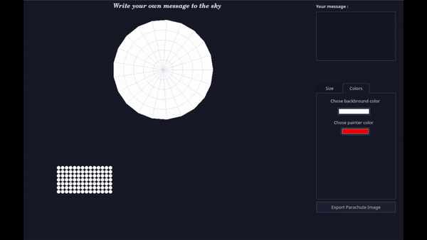

# Message in a parachute

**Context** : Second year project \
**Class** : Graphic interface design \
**Year** : 2020-2021

**Students** :

* Sarah Brood *sarah.brood@ecole.ensicaen.fr*
* Adrien David *adrien.david@ecole.ensicaen.fr*

## What is this ?
A software which allows to create the display of a parachute with a message as the rover Perservance did have when it launched on Mars.  
## Installation & Usage
You need to have QT4 or higher.

## Our implementation

## Architecture

We chose to implement a MVP patron but we got some issues when we linked the view and the model.\
We created classes to represent the message. The message is a vector of Letter described by a 7 long bitset.

## Features

### Implemented
As recommendend we have implemented so far : 
- a model representing the message as we described above
  - we encountered a problem for a the access of the kth bit : we discovered it was meaningless to do it that way because the view as to know the entire bitset  
- a binary view of the parachute adapted to what is displayed on the parachute
- tools to adjust the number of tracks and sector : spinboxes and sliders : the parachute and the binary view changes at the same time 
- menus and actions with icons and shortcuts to :
    - create a new parachute
    - open a parachute from a file
    - save as (in parachute format)
    - quit the application
    - about section
- traduction in french, the application is by default in english 
- the parachute format describes all the data in the application (message, sizes, colors)
### Additionals
We implemented these additional  features : 
- sliders goes 7 in 7 
- colors of the background and the 1-bit can be choose with a color picker 

### Propositions
We chose to implement the following original features :
- the parachute view can be saved as a png image
## Issues

### Difficulties encountered
- We tried to implement a real MVP patron and took time to realize it couldn't be done 
- The translation feature wasn't easy to set up, in fact we struggled with the file formats ... 
- The icons didn't all show up 

### Known limitations and/or bugs
We didn't find a real bug in our actual project. Maybe if someone else tries to break it, he could find some ! \
\
\
\
    